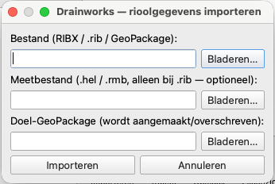
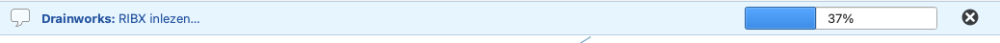
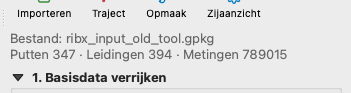

# Importeren

De eerste stap leest riooldata in en schrijft een **GeoPackage met basisdata** weg.

## Ondersteunde formaten

- **RIBX** (`.ribx` / `.xml`) — NEN 13508-2 inspectiedata.
- **SUFRIB** (klassiek) — een `.rib`-netwerkbestand met optioneel een meetbestand
  (`.hel` / `.rmb`).
- **GeoPackage** (`.gpkg`) — een eerder door Drainworks gemaakte (of compatibele) GeoPackage;
  deze wordt direct geopend.

## Stappen

1. Klik op **Importeren** in de hoofdknoppenbalk.
2. Kies het **bestand** (RIBX / `.rib` / GeoPackage).
3. Alleen bij SUFRIB: kies eventueel het **meetbestand** (`.hel` / `.rmb`).
4. Kies de **doel-GeoPackage** (wordt aangemaakt/overschreven). Bij het kiezen van een
   invoerbestand wordt automatisch een naam voorgesteld.
5. Klik **Importeren**.

{width=5.9cm}

*Het importdialoog "Drainworks — rioolgegevens importeren" met de drie velden ingevuld.*

Het inlezen draait op de achtergrond; bovenin verschijnt een **voortgangsbalk met
benoemde stappen** (bijv. *RIBX inlezen… → GeoPackage wegschrijven… → Klaar*). Als het
klaar is, worden de lagen **Putten**, **Leidingen** en (na verrijken) **Segmenten** in een
laaggroep met de naam van de GeoPackage op de kaart geladen, en zoomt de kaart naar het
netwerk.

*De voortgangsbalk bovenin tijdens het importeren.*

> **Oude of niet-Drainworks GeoPackages.** Open je een GeoPackage die niet het
> Drainworks-schema heeft (gemaakt met een ander programma of een oudere versie), dan
> verschijnt een duidelijke melding en wordt hij **niet** geladen. Maak hem in dat geval
> opnieuw aan door het oorspronkelijke RIBX/SUFRIB-bestand te importeren.

## Resultaat

- **Putten** (puntlaag): code, maaiveld, bodemhoogte, is_sink.
- **Leidingen** (lijnlaag): code, knopen, diameter, BOB-begin/eind, lengte, materiaal.
- **Metingen** (`measurements_raw`): de ruwe hellingshoekmetingen (nog niet omgezet naar
  hoogtes).

De bestandsinformatie in het paneel toont nu het aantal putten, leidingen en metingen.

{width=5.9cm}

*Het paneel met de bestandsinformatieregel ("Bestand: … · Putten N · Leidingen N · Metingen N").*

> **Let op:** correctie van BOB-metingen, segmentlengtes e.d. zijn géén importinstellingen;
> die horen bij stap 2 (zie het tandwiel bij "Verrijk basisdata").
