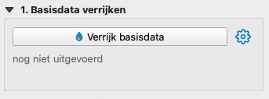
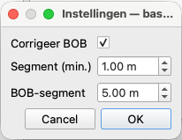
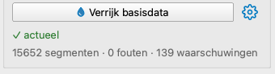
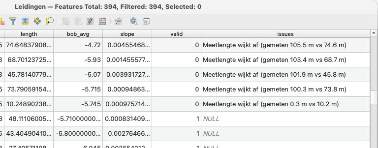

# Basisdata verrijken

De tweede stap maakt van de basisdata **verrijkte basisdata**: validatie, hoogtes en
segmenten. Je vindt hem in de eerste stapkaart, **1. Basisdata verrijken**.

{width=5.8cm}

*De stapkaart "1. Basisdata verrijken" met de knop, het tandwiel, de actueel-indicatie en de samenvatting.*

## Instellingen (tandwiel)

Klik op het **tandwiel** naast de knop voor de instellingen van deze stap:

- **Corrigeer BOB** — corrigeert de gemeten hoogtes op de bekende BOB's van begin/eind van
  de leiding (verwijdert drift in de hellingmetingen). Standaard aan. De precieze
  rekenmethode staat in de *Bijlage — rekenmethoden*.
- **Segment** — minimale lengte van een gemeten segment (standaard 1 m). De hellingmetingen
  leveren veel dicht op elkaar liggende punten; opeenvolgende punten worden samengevoegd tot
  segmenten van minstens deze lengte.
- **BOB-segment** — lengte van de segmenten voor leidingen *zónder* meting (standaard 5 m).
  Die leidingen hebben geen gemeten verloop; hun rechte lijn van begin-BOB naar eind-BOB
  wordt in stukken van deze lengte geknipt.

De instellingen worden bewaard (ook per GeoPackage) en zijn later weer op te vragen via het
tandwiel.

*Wat is een segment, en waarom telt de lengte?*

> Een **segment** is een stukje leiding met een eigen begin- en eind-BOB, gemiddelde helling,
> diameter en hoogste BOB. Samen vormen de segmenten het **hoogteprofiel van het stelsel**
> waarop de volgende stap rekent: de verloren berging (stap 3) bepaalt *per segment* waar water
> blijft staan achter een tegenhelling of in een lokale kom. De segmenten zijn dus de
> rekeneenheid — zonder segmenten geen berging.
>    
> Elk segment krijgt ook een **bron**: `measured` voor gemeten leidingen, `bob` voor de
> BOB-fallback. Bij een gemeten leiding zie je het werkelijke, doorhangende verloop; bij een
> BOB-segment een geïdealiseerde rechte helling (er is niet gemeten, dus verzakkingen zijn daar
> niet zichtbaar).
>    
> De **lengte** bepaalt het detailniveau. Korte segmenten leggen kleine verzakkingen en kommen
> vast (nauwkeuriger, maar meer data en rekentijd); lange segmenten geven een grover beeld.
> Vergroot de lengtes als het resultaat te rommelig of te zwaar wordt, verklein ze als je fijne
> kommen mist.

{width=3.5cm}

*Het dialoog "Instellingen — basisdata verrijken".*

## Uitvoeren

Klik op **Verrijk basisdata**. De stap draait op de achtergrond — bovenin loopt een
voortgangsbalk met benoemde stappen (*Valideren… → Hoogtes integreren… → Segmenten…*) — en
doet:

1. **Validatie** — controleert volledigheid (code, BOB, diameter, knooppunten aanwezig) en
   waardes binnen bereik (diameter 50–3000 mm, meetlengte ±20 % van de geometrielengte,
   hellingshoek, BOB onder het maaiveld van de aangrenzende put). Resultaten komen op de
   velden `valid`/`issues` van de leidingen/putten.
2. **Hoogtes** — zet de hellingmetingen om naar een hoogteprofiel (laag `profile`).
3. **Segmenten** — voegt gemeten punten samen tot segmenten (laag `segments`); voor
   leidingen zonder meting worden BOB-segmenten gemaakt.

Eerder berekende verloren berging wordt hierbij gewist (moet opnieuw).

## Resultaat

Onder de knop verschijnt:

- **Actueel-indicatie** — ✓ *actueel* of ⚠ *verouderd — verrijk opnieuw*.
- **Samenvatting** — bijv. *1697 segmenten · 3 fouten · 5 waarschuwingen*.
  - **Fouten** = ontbrekende/onbekende data (code, BOB, diameter, knooppunt).
  - **Waarschuwingen** = waardes buiten bereik (diameter, meetlengte, hellingshoek,
    BOB op of boven maaiveld).

{width=5.8cm}

*De stapkaart na verrijken met "✓ actueel" en de samenvatting.*

Verder zijn de resultaten per put/ leiding te bekijken via de tabellen van deze kaartlagen. Hier
zijn de kolommen `valid` en `issues` toegevoegd:

- **`valid` = 1** — de leiding of put is goed: de validatie vond **geen** problemen.
- **`valid` = 0** — er is minstens één probleem gevonden; de omschrijving(en) staan in het
  veld `issues`.

{width=13.0cm}

*De validatie gegevens in de tabel.*

## Placeholder-BOB's (0.00) in de bron

Sommige RIBX-exports vullen **0.00** in als een BOB niet is ingemeten. Dat is geen echte
hoogte: een BOB op 0 m NAP ligt (ver) boven het maaiveld. In het zijaanzicht zie je dan een
punt boven het maaiveld bij de put en duikt de lijn "BOB gemeten" van daaruit steil naar de
metingen; de stippellijn "BOB leiding (recht)" wordt op 0 m NAP getekend en lijkt daardoor
te ontbreken. De validatie markeert deze strengen met de waarschuwing *"BOB … op of boven
maaiveld"* (`valid` = 0).

Zo los je het op:

1. Zoek de gemelde strengen op (filter op `valid` = 0 of lees `issues`).
2. Corrigeer `bob1`/`bob2` in de tabel van de laag **Leidingen** met de juiste waardes en
   sla de bewerking op. De afgeleide velden `bob_avg` en `slope` hoef je niet zelf in te
   vullen — die worden bij het verrijken opnieuw berekend.
3. Klik op **Verrijk opnieuw**. Het zijaanzicht gebruikt daarna direct de gecorrigeerde
   waardes.

## Opnieuw verrijken

Pas je in QGIS een BOB of leiding aan (en sla de bewerking op), dan springt de knop op
**Verrijk opnieuw** (⚠ verouderd) en tekent het zijaanzicht meteen met de aangepaste
waardes. Klik nogmaals om de segmenten/profielen te herbouwen.
