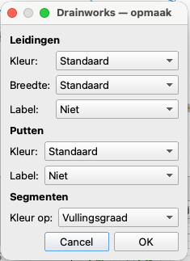
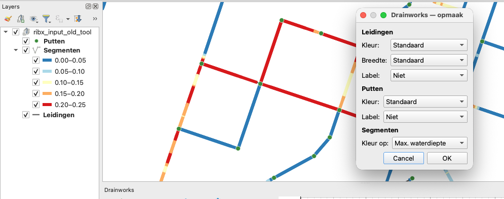

# Opmaak van de kaart

Met **Opmaak** in de hoofdknoppenbalk (kwasticoon) pas je de kaartweergave van leidingen,
putten en segmenten aan. De keuzes gebruiken *graduated* renderers, zodat de legenda in het
lagenpaneel meeverandert.

{width=4.0cm}

*Het dialoog "Drainworks — opmaak" met de secties Leidingen, Putten en Segmenten.*

## Leidingen

- **Kleur**: Standaard (donkergrijs) · Hoogteligging (BOB) · Verhang.
- **Breedte**: Standaard · Diameter.
- **Label**: Niet · Code · BOB (begin/eind) · Diameter.

## Putten

- **Kleur**: Standaard · Bodemhoogte · Maaiveld.
- **Label**: Niet · Code · Bodemhoogte · Maaiveld.

## Segmenten

De segmenten liggen **boven** de leidingen. Kleur ze op:

- **Vullingsgraad** (`flooded_pct`) — de standaard 0–25 / 25–50 / 50–75 / 75–100 %-klassen.
- **Waterhoogte** (`water_level`).
- **Max. waterdiepte** (`water_depth_max`).

*De kaart met segmenten gekleurd op max. waterdiepte, met de bijbehorende legenda in het lagenpaneel.*
